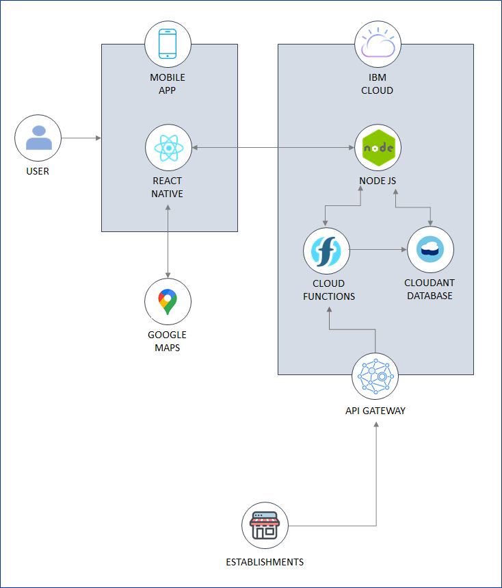
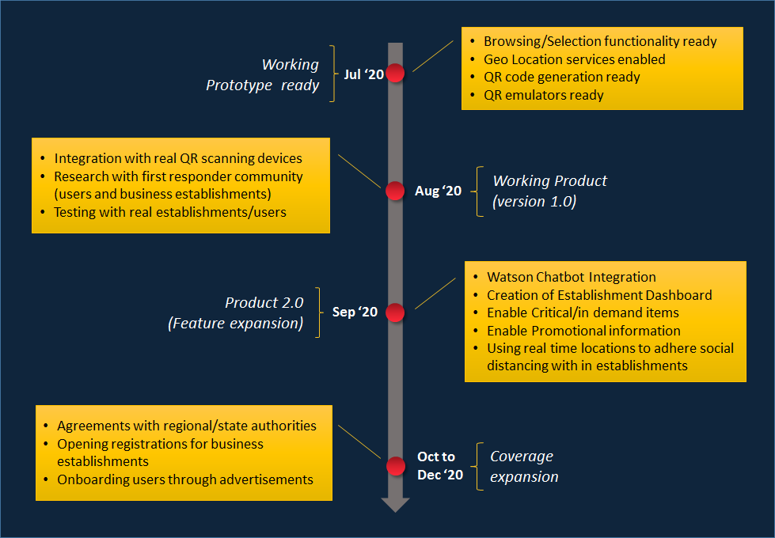

# Project-Alpha

This Repository contains artifacts pertaining Call for Code 2020 on Theme : COVID-19. Pl visit  [![Website] (https://callforcode.org/) for more details on the event.

## Contents

1. [Short description](#short-description)
1. [Demo video](#demo-video)
1. [The architecture](#the-architecture)
1. [Long description](#long-description)
1. [Project roadmap](#project-roadmap)
1. [Getting started](#getting-started)
1. [Running the tests](#running-the-tests)
1. [Live demo](#live-demo)
1. [Built with](#built-with)
1. [Contributing](#contributing)
1. [Versioning](#versioning)
1. [Authors](#authors)
1. [License](#license)
1. [Acknowledgments](#acknowledgments)

## Short description

The idea enables people to avoid crowded places (grocery stores, restaurants, shopping malls, etc) and also provides platform to business establishments to track and manage crowd during these crisis times.

### What's the problem?

Most countries are proceeding with post lockdown phase, to revive commerce in times of crisis. Consequently, there are several challenges coming up in this new normal. One such challenge is how to avoid crowding various business establishments (such as shopping centers, restaurants, public  parks, offices and public/private institutions) to curb the Covid-19 spread.
Governments are rolling out larger initiatives through publishing broadcasts and traditional social media, to create awareness and impose restrictions (for example, limiting the number of people at any given time). 
However, this one way communication lacks local focus and real time information about places people plan to visit. Finally, the individual is left on their own to go out. People have to think twice to venture out for important activities such as doing daily groceries.

### How can technology help?

The solution enables people with a mobile app, that allows them to get real-time crowd information about nearby malls, parks and restaurants. The app enables users, to browse and select places (that is safe to visit) and generates unique QR code. On reaching the place, the user needs to scan this QR code at entry gate (same activity needs to be performed at exit gate as well). This scanned information is then transferred to IBM Cloud platform through simple HTTPS API calls. Services developed using IBM Cloud Functions gathers the information and stores in Cloudant DB.

### The idea

This idea focusses on limiting crowd in business establishments by providing real-time information to people to help decide on places that are safe to visit. The establishments, in this context, are a premise that are gated and have entry/exit gates. These can be shopping malls, restaurants, parks and offices in any region, country or geography. The ideas also helps authorities to monitor crowd information in such places, in real time and enable them to take appropriate decisions, actions.

## Demo video

[](https://youtu.be/_BmSglB1LZo)

## The architecture



## Project roadmap



## Getting started

These instructions will get you a copy of the project up and running on your local machine for development and testing purposes. See deployment for notes on how to deploy the project on a live system.

### Prerequisites

- Register for an [IBM Cloud](https://www.ibm.com/account/reg/us-en/signup?formid=urx-42793&eventid=cfc-2020?cm_mmc=OSocial_Blog-_-Audience+Developer_Developer+Conversation-_-WW_WW-_-cfc-2020-ghub-starterkit-cooperation_ov75914&cm_mmca1=000039JL&cm_mmca2=10008917) account.
- Install and configure [IBM Cloud CLI](https://cloud.ibm.com/docs/cli?topic=cloud-cli-getting-started#overview).
- Install [React Native CLI dependencies](https://reactnative.dev/docs/getting-started.html). See the [React Native documentation](https://reactnative.dev/docs/environment-setup) for the exact steps and requirements based on your Operating System and Target OS. For example:
    - **iOS on macOS**
        - [Node.js](https://nodejs.org/en/)
        - [Watchman](https://facebook.github.io/watchman/docs/install)
        - [Xcode](https://itunes.apple.com/us/app/xcode/id497799835?mt=12)
        - [CocoaPods](https://guides.cocoapods.org/using/getting-started.html)
    - **Android on Windows**
        - [Node.js](https://nodejs.org/en/)
        - [Android Studio](https://developer.android.com/studio/index.html) - add Android 9 (Pie) SDK & configure `ANDROID_HOME`
        - [Create an Android Virtual Device (AVD)](https://developer.android.com/studio/run/managing-avds.html) - with Pie image (API Level 28)
- Clone the [repository](https://github.com/Call-for-Code/Solution-Starter-Kit-Cooperation-2020).

### Steps

1. [Provision a CouchDB instance using Cloudant](#1-Provision-a-CouchDB-instance-using-Cloudant).
1. [Setup Serverless Cloud Functions](#2-setup-cloud-functions).
1. [Run the server](#3-run-the-server).
1. [Run the mobile application](#4-run-the-mobile-application).

### 1: Provision a CouchDB instance using Cloudant

Log into the IBM Cloud and provision a [CouchDB instance using Cloudant](https://www.ibm.com/cloud/cloudant).

1. From the catalog, select Databases and then the Cloudant panel.
1. Once selected, you can choose your Cloudant plan -- there is a free tier for simple testing that is sufficient to run this CIR example. You should choose an appropriate region, give the service a name, and it is recommended you choose **Use only IAM** under **Available authentication methods**. You can leave the other settings with their defaults. Click the blue **Create** button when ready.
1. Once your Cloudant instance has been created, you need to create a service credential that the CIR API Server can use to communicate with it. By selecting your running Cloudant instance, you can choose **Service credentials** from the left-hand menu. Create a new service credential and give it a name (it doesn't matter what you call it).
1. Once created, you can display the credentials by selecting **view service credentials**, and then copy the credential, so you are ready to paste it into the code of the API server in Step 4.

### 2 : Setup Serverless Cloud Function

Log into the IBM Cloud and provision a [Cloud functions](https://cloud.ibm.com/functions).

1. In the browser, open a tab and go to Functions.
1. From the namespace drop-down on the top right either select an existing namespace or use **Create Namespace** to create a new one.
1. With a namespace selected, click on **Actions** in the left pane and then **Create** on the right.
1. Under **Create** click on **Action** to open the **Create Action** form.
1. Enter `prepare-entry-for-save` as name, click **Create Package** to create a new package with name `alpha-functions` and pick a **Node.js** as **Runtime** (Note: Pick the latest version). Click **Create** to create the action.
1. In the new dialog replace the existing code with the code snippet below:

```bash
/**
 * Prepare the premise registration entry to be persisted
 */
function main(params) {
  if (!params.type || !params.name || !params.latitude || !params.longitude || !params.maxLimit) {
    return Promise.reject({ error: 'no type or name or latitude or longitude or maxlimit'});
  }
  
  const todaysDate = new Date();

  return {
    doc: {
      type: params.type,
      name: params.name,
      description: params.description,
      address: params.address,
      timings: params.timings,
      instructions: params.instructions,
      latitude: params.latitude,
      longitude: params.longitude,
      maxLimit: params.maxLimit,
      currentStrength: (params.currentStrength) ? params.currentStrength : 0,
      whenCreated: todaysDate,
      lastModified: todaysDate
    }
  };
}
```
1. Thereafter click **Save**.

Then add the action to a sequence:

1. On the left pane, click on **Enclosing Sequences** and then **Add To Sequence**.
1. Under **Create New** set the **Sequence Name** to `save-establishment-entry-sequence` and choose **alpha-functions** as package.
1. Then finish by clicking **Create and Add**.

Now, add the second action to that sequence:
1. Click on the entry `save-establishment-entry-sequence`. It opens sequence details. Then click **Add** on the upper right.
1. Instead of **Create New** select **Use Public**. It loads and displays icons for available integrations. Pick **Cloudant**.
1. Under **Actions** choose **create-document**.
1. Create a New Binding and complete the form as follows:
    1. Set **Name** to `alpha-cloudant`.
    1. For **Instance**, **Credentials** and **Database**, select your cloudant details created in Step 1.
1. Click **Add**, thereafter **Save**.

Then create an API as follows:
1. Go to Actions.
1. Select the `save-establishment-entries-sequence` sequence. Next to the name, click on **Web Action**, check **Enable as Web Action** and **Save**.
1. Go to APIs and click **Create API** (or **Create Managed API **if you have existing APIs).
1. Set the API name to `alphacloudant` and, accordingly, the base path to `/alphacloudant`.
1. Click on **Create operation** and create an operation to save establishment entries:
    1. Set **path** to `/new`
    1. Set **verb** to `POST`
1. Select the `save-establishment-entries-sequence` action

### 3. Run the server

To set up and launch the server application:

1. Go to the `project-alpha/server-app` directory of the cloned repo.
1. Copy the `.env.example` file in the `project-alpha/server-app` directory, and create a new file named `.env`.
1. Edit the newly created `.env` file and update the `CLOUDANT_ID` and `CLOUDANT_IAM_APIKEY` with the values from the service credential you created in Step 1. (Note that the `username` from the credential is what should be used for the `CLOUDANT_ID`.)
1. Edit the **name** value in the `manifest.yml` file to your application name (for example, _my-app-name_).
1. From a terminal:
    1. Go to the `alpha-alpha/server-app` directory of the cloned repo.
    1. Install the dependencies: `npm install`.
    1. Launch the server application locally or deploy to IBM Cloud:
        - To run locally:
            1. Start the application: `npm start`.
            1. The server can be accessed at <http://localhost:3000>.
        - To deploy to IBM Cloud:
            1. Log in to your IBM Cloud account using the IBM Cloud CLI: `ibmcloud login`.
            1. Target a Cloud Foundry org and space: `ibmcloud target --cf`.
            1. Push the app to IBM Cloud: `ibmcloud app push`.
            1. The server can be accessed at a URL using the **name** given in the `manifest.yml` file (for example,  <https://my-app-name.bluemix.net>).

### 4. Run the mobile application

To run the mobile application (using real device):

1. Go to the `project-alpha/mobile-app` directory of the cloned repo.
1. Edit  `app.env` file as follows:
    - Update the `API_URL` with the URL to the server app launched in the previous step.
1. From a terminal:
    1. Go to the `starter-kit/mobile-app` directory.
    1. Install the dependencies: `npm install`.
    1. **iOS only**: Go to the `ios` directory: `cd ios`.
    1. **iOS only**: Install pod dependencies: `pod install`.
    1. **iOS only**: Return to the `mobile-app` directory: `cd ../`.
    1. Launch the app in the simulator/emulator:
        - **iOS only**: `npm run ios`
            > **Note**: You should be running at least iOS 13.0. The first time you launch the simulator, you should ensure that you set a Location in the Features menu.
        - **Android only**: `npm run android`
            > **Note**: Your Android Studio needs to have the `Android 9 (Pie)` SDK and a `Pie API Level 28` virtual device    
